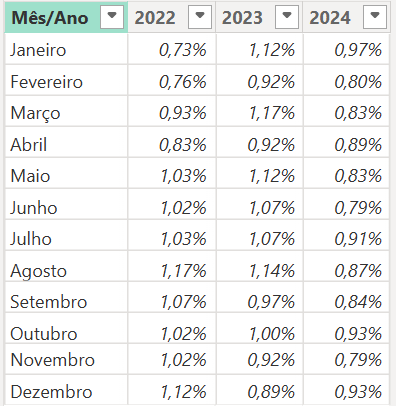

# Acompanhamento Mensal da Evolução da Taxa Selic 2025

Esse projeto tem como objetivo permitir o acompanhamento da evolução da taxa selic mensal no ano vigente (2025). Além de permitir acomparar a evolução com os anos seguintes ate 2022. 

Os dados são atualizados mensalmente, de acordo com as informações divulgadas no site oficial do Tesouro Direto.

Adicionei um filtro ao lado esquerdo do dash, que permite filtrar as informações por mês

## Informações adicionadas nas planilhas Excel:

 

## Modelagem:

